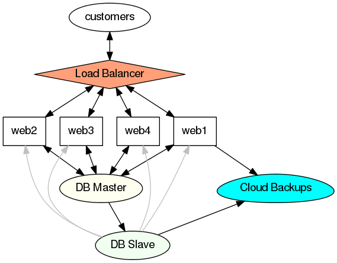

# Autoscale - Introduction

## What is Autoscale ?

The easiest way to explain is with an imaginary case study.

Joe has a website behind a load balancer. It's very popular. With 1 GB of RAM, he can serve about 5 requests at a time, which is fine most days, but when his site gets mentioned on TV, his app has to serve up to 300 requests at once. 

Two of the options that Joe has to handle the TV spots are:

 * Scale Up:  Build a new server with 20*300=5000 MB of RAM
 * Scale Out: Build 5 x 1GB servers. Autoscale will do the latter for you, automatically.

## Advantages to scaling out rather than up

### The old school mindset - Scaling Up

In the old school mindset, the server is king. You install your site on a server along with Apache, MySQL, PHP and everything you need. If your traffic increases, you grow the server. With older cloud servers, you'd resize it. With dedicated servers, you'd order the new chassis and/or disks, and move the disks across. This requires downtime. There is no scalability designed into the app.

Updates involve possibly automatic operating system updates and the occasional live code update. In this mindset, the server is more expensive than the app, so building a new server to test updates is out of the question.

We take nightly incremental backups. Disaster recovery involves building a new server from scratch, trying to remember all our code dependencies, and trial and error for hours or days to re-create a working environment.

Although some may argue I'm not being entirely fair here, in my experience this is a common result of implementing the old mindset.

### The cloud mindset - Scaling Out

In the new mindset, we design our app in a modular fashion to take advantage of what's available in the cloud; the app is king and the cloud serves it. The cloud consists of services; VMs, [cloud databases](http://www.rackspace.com/cloud/databases/), [queues](http://www.rackspace.com/cloud/queues/), [big-data](http://www.rackspace.com/cloud/big-data/), etc.

We use configuration and automation software to develop, deploy and scale the app. eg. [Puppet](http://puppetlabs.com/puppet/puppet-open-source), [chef](http://www.getchef.com/chef/), [salt stack](http://www.saltstack.com/), or [Ansible](http://www.ansible.com/home). This software uses [cloud APIs](http://docs.rackspace.com/) to build the necessary components.

The live data is continually backed up. The deployment code is stored in a code repository like git. With a backup of the data and the deployment code, you can rebuild your entire environment in a matter of minutes for disaster recovery, testing, or upgrading.

Everything is automated and tested from the beginning; updates, scaling, even disaster recovery to a certain extent.

## Getting started

This is the architecture we'll be using in our examples.

1. Overview - Advantages to scaling out rather than up. Choosing an archetecture, making sure not to overload the DB(s), using read-only DB slaves, how to share php and magento session info between nodes(glusterfs/memcached), how to share and handle files and file writes (glusterfs/lsyncd+varnish/nginx)
